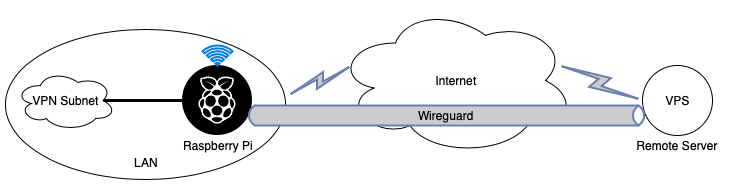

## Raspberry PI WireGuard VPN Hotspot

## 1. Introduction

This project aims to create a VPN subnetwork in LAN using with Raspberry Pi.
Raspberry Pi directs outgoing packets to remote server and directs incoming packets to
devices connected on the endpoint. Raspberry Pi uses Network Address Translation to perform
this operation. NAT operations are handled with iptables.
Tunnelling process is handled with WireGuard. Both peers run WireGuard module with
same configuration for tunnelling.

### 1.1. WireGuard

WireGuard is a free and open-source software application and communication
protocol that implements VPN techniques to create secure point-to-point connections
in routed or bridged configurations. It is run as a module inside the Linux kernel.

<p align="center">
 
 <br/>
 WireGuard Comparisons with IPSec and OpenVPN
</p>

WireGuard is a lightweight module and it utilizes state-of-the-art cryptography,
like the Noise protocol framework, Curve25519, ChaCha20, Poly1305, BLAKE2,
SipHash24, HKDF. WireGuard aims to be faster, simpler and leaner than IPSec and
OpenVPN.

## 2. Requirements

1. Remote Server
   - is configured for WireGuard connections.
   - can host a WireGuard peer.
2. Raspberry Pi
   - can start a hotspot.
   - can create a NAT between the subnet and remote server.
   - can handle the outgoing connections and incoming connections in the subnet.
   - can connect the remote WireGuard peer.
3. Devices connected on Raspberry Pi connect internet on WireGuard VPN.

## 3. Design

The design structure is shown below.

<p align="center">
 
 <br/>
 Structure
</p>

## 4. Configurations

### 4.1. Server WireGuard Configuration

1. Install WireGuard on the VPN server

   ```sh
   add-apt-repository ppa:wireguard/wireguard
   apt-get update
   apt-get install wireguard-dkms wireguard-tools linux-headers-$(uname -r)
   ```

2. Generate server and client keys

   ```sh
   Umask 077
   wg genkey | tee server_private_key | wg pubkey > server_public_key
   wg genkey | tee client_private_key | wg pubkey > client_public_key
   ```

3. Generate server config

   ```sh
   cp ./server/wg0.conf /etc/wireguard/wg0.conf
   ```

   Edit the lines with keys in _/etc/wireguard/wg0.conf_

   ```
   PrivateKey = <insert server_private_key>
   PublicKey = <insert client_public_key>
   ```

4. Generate client config

   ```sh
   cp ./server/wg0-client.conf /etc/wireguard/wg0-client.conf
   ```

   Edit the lines with keys in _/etc/wireguard/wg0-client.conf_

   ```
   PrivateKey = <insert server_private_key>
   PublicKey = <insert client_public_key>
   ```

5. Enable the WireGuard interface on the server.

   ```sh
   chown -v root:root /etc/wireguard/wg0.conf
   chmod -v 600 /etc/wireguard/wg0.conf
   wg-quick up wg0

   # Enable the interface at boot
   systemctl enable wg-quick@wg0.service
   ```

6. Enable IP forwarding on the server

   Edit the file _/etc/sysctl.conf_ and set the following line as:

   ```
   net.ipv4.ip_forward=1
   ```

   Then also do the following to stop having to reboot the server

   ```sh
   sysctl -p
   echo 1 > /proc/sys/net/ipv4/ip_forward
   ```

7. Configure firewall rules on the server

   Track VPN connection

   ```sh
   iptables -A INPUT -m conntrack --ctstate RELATED,ESTABLISHED -j ACCEPT
   iptables -A FORWARD -m conntrack --ctstate RELATED,ESTABLISHED -j ACCEPT
   ```

   Allow incoming VPN traffic on the listening port

   ```sh
   iptables -A INPUT -p udp -m udp --dport 51820 -m conntrack --ctstate NEW -j ACCEPT
   ```

   Allow both TCP and UDP recursive DNS traffic

   ```sh
   iptables -A INPUT -s 10.200.200.0/24 -p tcp -m tcp --dport 53 -m conntrack --ctstate NEW -j ACCEPT
   iptables -A INPUT -s 10.200.200.0/24 -p udp -m udp --dport 53 -m conntrack --ctstate NEW -j ACCEPT
   ```

   Allow forwarding of packets that stay in the VPN tunnel

   ```sh
   iptables -A FORWARD -i wg0 -o wg0 -m conntrack --ctstate NEW -j ACCEPT
   ```

   Setup NAT

   ```sh
   iptables -t nat -A POSTROUTING -s 10.200.200.0/24 -o eth0 -j MASQUERADE
   ```

   Save rules

   ```sh
   apt-get install iptables-persistent
   systemctl enable netfilter-persistent
   netfilter-persistent save
   ```

8. Configure DNS

   ```sh
   apt-get install unbound unbound-host
   curl -o /var/lib/unbound/root.hints https://www.internic.net/domain/named.cache
   ```

   Copy unbound.conf from server

   ```sh
   cp ./server/unbound.conf /etc/unbound/unbound.conf
   ```

   Enable DNS resolver

   ```sh
   chown -R unbound:unbound /var/lib/unbound
   systemctl enable unbound
   ```

### 4.2. Client Access Point Configuration

1. Install hostapd and udhcpd

   ```sh
   apt-get update
   apt-get install hostapd udhcpd
   systemctl unmask hostapd
   systemctl enable hostapd
   ```

2. Backup existing files

   ```
   cp /etc/udhcpd.conf /etc/udhcpd.conf.old
   cp /etc/default/udhcpd /etc/default/udhcpd.old
   cp /etc/network/interfaces /etc/network/interfaces.old
   cp /etc/hostapd/hostapd.conf /etc/hostapd/hostapd.conf.old
   cp /etc/default/hostapd /etc/default/hostapd.old
   cp /etc/sysctl.conf /etc/sysctl.conf.old
   cp /etc/iptables.ipv4.nat /etc/iptables.ipv4.nat.old
   ```

3. Copy OpenDNS conf

   ```
   cp ./client/udhcpd_opendns.conf /etc/udhcpd.conf
   ```

4. Copy udhcpd conf

   ```sh
   cp ./client/udhcpd /etc/default
   ```

5. Copy hostapd conf

   ```sh
   cp ./client/hostapd.conf /etc/hostapd
   ```

6. Copy NAT conf

   ```sh
   cp ./client/sysctl.conf /etc
   touch /var/lib/misc/udhcpd.leases
   ```

7. Initialize Access Point

   ```sh
   service hostapd start
   update-rc.d hostapd enable
   ```

8. Initialize DHCP server

   ```sh
   service udhcpd start
   update-rc.d udhcpd enable

   sleep 5
   reboot
   ```

### 4.3. Client WireGuard Configuration

1. Set up Wireguard on clients
    ```sh
    add-apt-repository ppa:wireguard/wireguard
    apt-get update
    apt-get install wireguard-dkms wireguard-tools linux-headers-$(uname -r)
    ```

2. Copy wg-client.con from server
    ```sh
    wg-quick up wg0-client
    ```

## 5. Verification

- **Confidentiality:** All data between client and server encrypted with state-of-the-art cryptography methods. Keys secured in each side.
- **Integrity:** Connection between peers secured with tunnelling.
- **Availability:** Connection is available for both sides up to 99.9%.

## 6. Conclusion & Further Work

- In conclusion, this project allows users to connect a remote VPN server without any configurations in Raspberry Pi Wifi endpoint. Security and tunnelling process handled with WireGuard for best performance.

- As further work, the Remote server may connect the internet over The Onion Routing (TOR) to improve anonymity.

